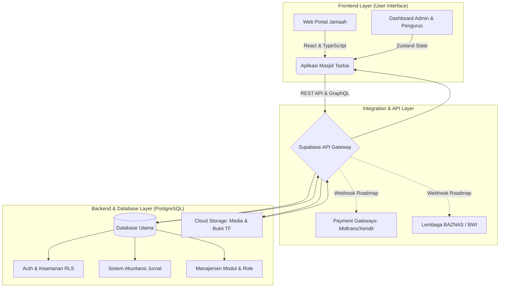
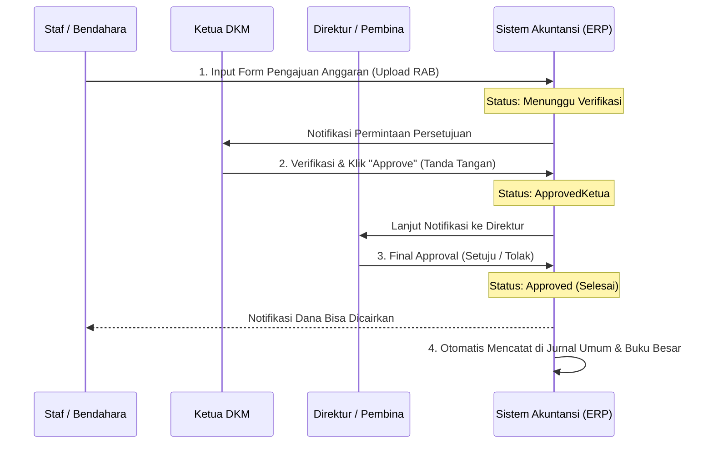
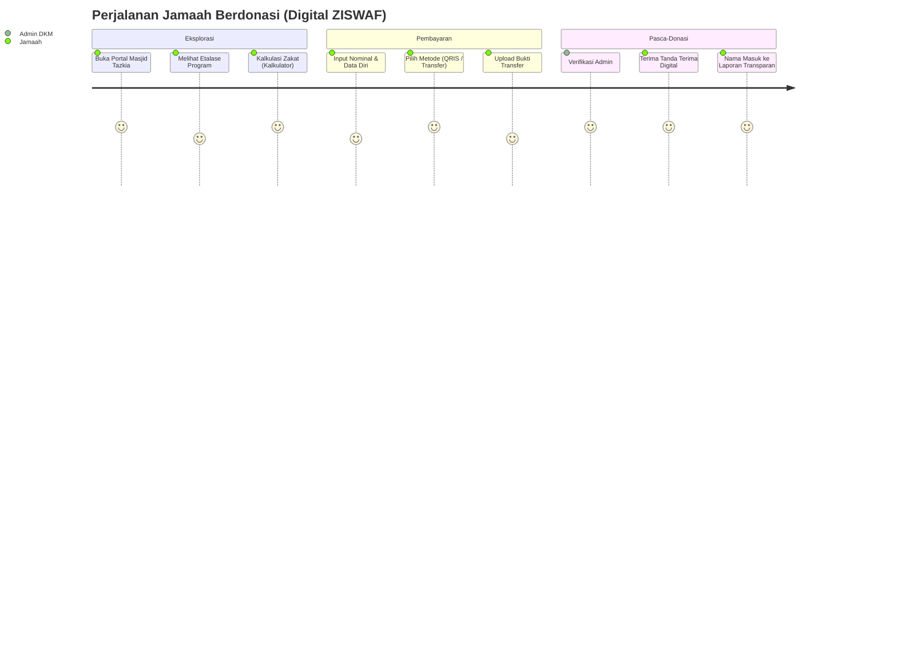

# 🕌 BLUEPRINT SISTEM ERP & PORTAL ZISWAF MASJID TAZKIA SENTUL

Dokumen ini merupakan cetak biru (*blueprint*) komprehensif dari arsitektur perangkat lunak, pemetaan fitur, alur kerja sistem, dan peta jalan (*roadmap*) pengembangan Aplikasi Masjid Tazkia. Dokumen ini disiapkan khusus untuk presentasi tingkat Direksi dan Manajemen.

---

## 1. RINGKASAN EKSEKUTIF (EXECUTIVE SUMMARY)

Aplikasi ini dibangun untuk mentransformasi Masjid Tazkia dari sekadar pusat ibadah menjadi **Pusat Ekosistem Digital Berbasis Masjid** yang sangat transparan, modern, dan terukur. Sistem ini bukan sekadar *website* profil, melainkan sebuah **Sistem ERP (Enterprise Resource Planning)** skala penuh yang mencakup manajemen ZISWAF (Zakat, Infaq, Sedekah, Wakaf), Akuntansi Syariah (Standar PSAK 109 & PSAK 409), Manajemen Aset, hingga Tata Kelola Karyawan (SDM).

---

## 2. ARSITEKTUR SISTEM TINGKAT TINGGI (HIGH-LEVEL ARCHITECTURE)

Sistem dibangun menggunakan *stack* teknologi modern yang teruji di industri global (Super-App Architecture).

---

## 3. PETA MODUL UTAMA (CORE FEATURES MAP)

| Modul Utama | Sub-Fitur & Deskripsi | Target Pengguna |
| :--- | :--- | :--- |
| **ZISWAF & Qurban** | Etalase Program Donasi, Kalkulator Zakat, Patungan Qurban, Notifikasi *Real-time*. | Jamaah, Admin |
| **Akuntansi Syariah** | Jurnal Umum, Buku Besar, Bagan Akun (COA), Laporan Posisi Keuangan, Kas Kecil. | Bendahara, Auditor |
| **Pencairan Anggaran** | Form Pengajuan Dana, Sistem *Approval* 3 Tingkat, Rekam Bukti Pencairan. | Staf, Pimpinan |
| **Manajemen Aset** | Pencatatan Barang Masuk/Keluar, Kalkulasi Nilai Aset, Status Kelayakan Barang. | Logistik / Sarpras |
| **Booking & Sewa** | Penyewaan Gedung/Ruangan, Cek Kalender Ketersediaan, Hitung Harga Sewa Otomatis. | Jamaah, Admin |
| **HR & Penjadwalan** | Jadwal Muadzin, Khotib, Imam, Absensi Petugas Kebersihan / Keamanan. | Sekretariat |
| **Interaksi Jamaah** | Layanan Aduan, Kirim Pesan Siaran (Broadcast WhatsApp/Email), Buku Panduan. | Jamaah, Humas |

---

## 4. ALUR KERJA SISTEM (SYSTEM WORKFLOWS)

### A. Alur Tata Kelola Pencairan Dana (3-Tier Approval)
Keamanan dan transparansi dana adalah prioritas utama. Setiap pengeluaran kas wajib melewati gerbang persetujuan berjenjang.

### B. Alur Donasi ZISWAF Jamaah
Kemudahan jamaah dalam berdonasi secara digital.

---

## 5. TATA KELOLA AKUN & HAK AKSES (ROLE-BASED ACCESS CONTROL)

Sistem ini sangat ketat dalam membatasi siapa yang bisa melihat dan mengedit data (*Zero Trust Architecture*).

- 🛡️ **Ketua Dewan Pembina / Direktur**: Fokus pada **Persetujuan (Approval)** tingkat akhir, pemantauan grafik *dashboard*, dan pencetakan Laporan Keuangan (Neraca). Form pengajuan dan input teknis disembunyikan/dibatasi.
- 🛡️ **Ketua DKM**: Verifikator tingkat 1, memiliki wewenang mengontrol jalannya program ZISWAF, inventaris, dan pengawasan penjadwalan petugas.
- 👨‍💻 **Bendahara / Akuntan**: Akses penuh ke Jurnal Umum, Chart of Accounts (COA), pembuatan Form Pengajuan Anggaran, dan verifikasi bukti donasi.
- 👨‍💼 **Admin / Staf**: Input data inventaris, jadwal muadzin, publikasi pengumuman, dan artikel kajian. Tidak bisa mengakses Laporan Keuangan rahasia.
- 👥 **Jamaah**: Akses terbatas ke *frontend* (beranda), portal donasi, pengajuan sewa, kompas kiblat, kalender, dan layanan aduan (tanpa bisa melihat rahasia dapur keuangan).

---

## 6. PETA JALAN PENGEMBANGAN MASA DEPAN (ROADMAP TO SCALABILITY)

Aplikasi ini sudah dipersiapkan ( *future-proof* ) untuk fase transformasi digital selanjutnya:

> [!TIP]
> **Fase 2: Otomatisasi Finansial Terpadu**
> Integrasi API langsung dengan *Payment Gateway* (Midtrans/Xendit) untuk pembayaran QRIS dinamis dan Virtual Account tanpa perlu verifikasi manual (Webhooks). Integrasi *Bridging* API dengan BAZNAS & BWI.

> [!IMPORTANT]
> **Fase 3: Marketplace Ekosistem Masjid**
> Pengembangan modul `Toko Jamaah`, di mana jamaah bisa saling jual-beli produk UMKM binaan masjid. Keranjang belanja, sistem ongkos kirim, dan bagi hasil otomatis ke kas masjid.

> [!NOTE]
> **Fase 4: Peluncuran Native Mobile Apps**
> Membungkus arsitektur yang sudah solid ini dengan Capacitor / React Native untuk diluncurkan secara resmi di **Google Play Store (Android)** dan **Apple App Store (iOS)**, menjangkau ratusan ribu jamaah di seluruh nusantara.

---
*Blueprint disusun oleh Tim Pengembang Utama untuk keperluan Presentasi Manajemen Masjid Tazkia Sentul - 2026*
